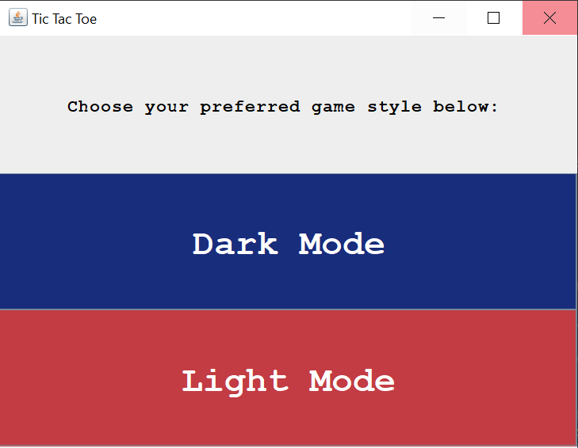
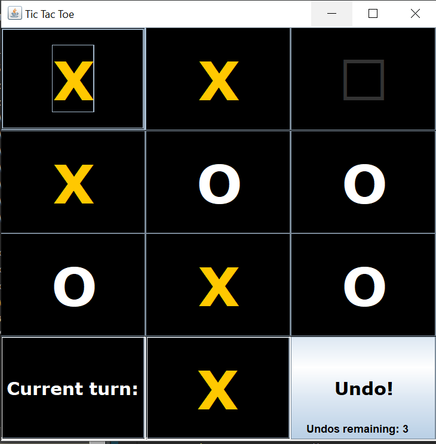
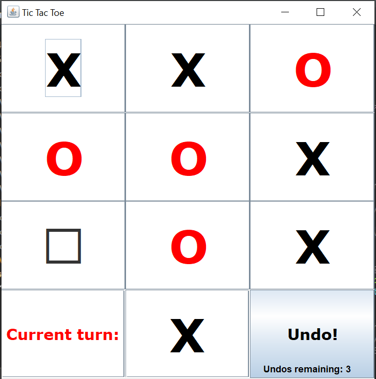
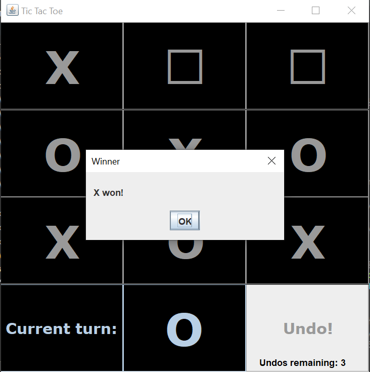

A Tic Tac Toe game implemented using the MVC Pattern and the Strategy Pattern. User can select different styles to play the game (light mode, dark mode, etc) and the board's characteristics change accordingly. For example, choosing dark mode makes the X and O markers alternate colors between gold and white. Game supports an undo button, allowing users to undo their current move for up to 3 times per turn.

Initial Menu:

Dark Mode:

Light Mode:

Winning Screen Example:

