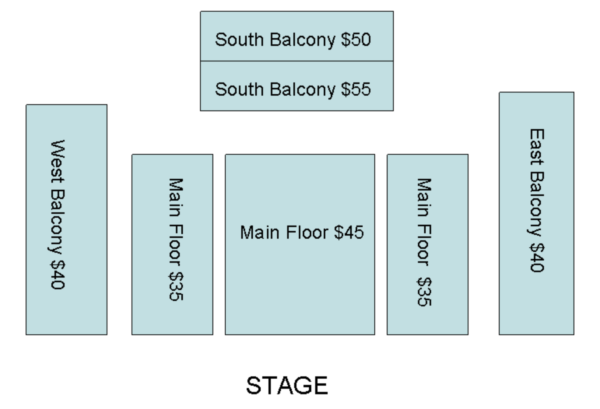

# Theater-Reservation-System-
Models a real life theater reservation system with Java, allowing users to reserve seats for shows, cancel reservations, and be calculated and printed a receipt for their transaction.

Overview
-----------------------------------
This assignment is to design and implement a simple theater reservation system. The design goals include identifying classes, their responsibilities, and their relationships. These goals can be achieved by conducting use case analysis, noun-verb analysis, producing CRC cards, and producing UML class and sequence diagrams.

Reservation System Description
-----------------------------------
During the season between December 23, 2020 and January 2, 2021, the theater presents "Miracle on 34th Street". The show is scheduled at 6:30 pm and 8:30 pm on a given date.

System Functions
-----------------------------------
When the system starts, it loads "reservations.txt" containing reservations made earlier. If the file does not exist or empty because it is the very first run of the program, the system doesn't load anything.
Then, the program prompts the following initial menu:
Sign [U]p   Sign [I]n   E[X]it
 
A new user first signs up for the system, and then signs in the system using the user id and password. An existing user can directly sign in.

1. Sign [U]p: The system asks for a user id and a password. The user id must be unique in the system, and a simple password is acceptable.

2. Sign [I]n: The system checks the validity of the user id and password entered by the user. The system presents an error message for any non-existing user id or an invalid password. With a valid credential, a transaction starts for the user.

3. E[X]it: This option terminates the system, meaning you will get an operating system prompt back to you. This is not a user option in the real world but is used as a way to persist the in-memory data in a file for this assignment. With this option, the system copies the valid reservations of all registered users from the in-memory data structure to a file called 'reservations.txt'.

When a user signs in, a transaction mode starts. That is, a transaction mode starts with sign-in and ends with sign-out. In the transaction mode, the user can choose options from the following transaction menu. This menu will be displayed after each selected option is done until the user enters O the sign-out to finish the transaction mode.
[R]eserve    [V]iew    [C]ancel    [O]ut     
 
1. [R]eserve: During a reservation session, that starts with R and ends with a user's confirmation, the following interactions are done between the user and the system. The system prompts the user to enter the date and time of the desired show. Then, it displays the list of all available seats for the requested show. The user can reserve multiple seats across different sections for the given show by entering the corresponding seat numbers. If the user attempts to reserve an unavailable seat, the system prompts an error message asking for another seat. Once the user is done with the reservation for a particular show, the system asks if the user wants to make another reservation or to confirm the reservation session, which will end the reservation session. The system saves all the reservations made in that session, technically saving them in an in-memory data structure of your choice such as arrays or array lists.

2. [V]iew: The user should be able to view the entire reservations of the user or the user's reservations by date. Reservations are displayed in the order of date and then time.

3. [C]ancel Reservation: The system asks for the date and time of the show and displays all the seat numbers of the show reserved for the user. The user selects seat numbers and the system cancels them, technically removing them from the in-memory.

4. [O]ut: The system displays a receipt for the transaction. The receipt begins with a confirmation number and is organized by shows with reserved seats in the order of date and time of the shows. For each show, include the date, time, seat numbers, and the total price charged for the show. (See the price and discount information below.) At the end of the receipt, include the total price charged for this transaction.

When the user signs out, the system prompts the initial menu again asking for another user to sign up or sign in or to terminate the program.
Sign [U]p   Sign [I]n   E[X]it

Seat and Price Information
-----------------------------------
In the theater, there is 1 auditorium with four different types of sections (Main Floor and South, East and West Balconies) with different ticket prices as shown below. (The seat numbers are listed inside of the parentheses.)

Main Floor: $35 (left side: m1-m50, right side: m51-m100), $45 (m101-m150)

South Balcony: $50 (sb1-sb25), $55(sb26-sb50)

West Balconies: $40 (wb1-wb100)

East Balconies: $40 (eb1-wb100)

Discount Nights (December 26-27): $20 for any seat

Group Discount:

5-10 persons: $2 discount per ticket
11-20 persons: $5 discount per ticket
Does not apply during Discount Nights
Combined transactions do not qualify for discounts. (i.e. if a user purchased three tickets during one transaction then purchased two more tickets during another transaction, then no group discount is applied for any of the transactions and the combined.)
Group discount will be applied for the tickets purchased for a single show.
Group discount will be applied for the tickets purchased for several sections in a show. For example, a user reserve seats for a particular show through multiple reservation sessions (remember a reservation session begins with [R] and ends with a user confirmation), the latest reservation should apply a discount considering previous reservations made for the show. For example, if a user reserved 2 seats in one reservation session and reserved 3 more seats in another reservation session for the same show, the system considers the user reserved 5 seats for the show and applies the group discount.
Cancellation in part or whole may cause recalculation of ticket price if the number of tickets fall below the lower limit of people. (i.e. 11 tickets reserved, 2 cancel, ticket prices recalculated for 5-10 bracket)

